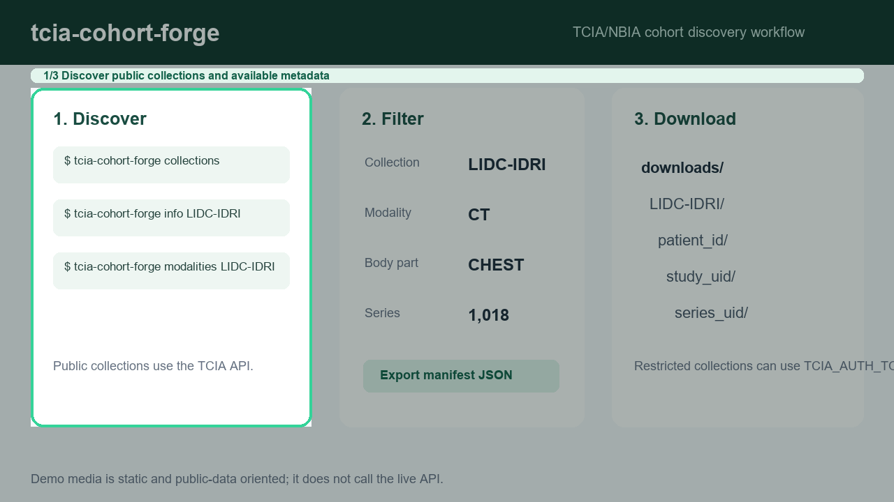

# tcia-cohort-forge

[](https://github.com/AKaturu/tcia-cohort-forge/actions/workflows/ci.yml)
[](https://www.python.org/)
[](LICENSE)
[](https://github.com/astral-sh/ruff)

> **Validation status:** Software functionality has been tested using synthetic data. This project has not undergone clinical validation.

**Query, browse, and download patient cohorts from The Cancer Imaging Archive (TCIA).**

`tcia-cohort-forge` is a CLI tool that wraps the NBIA v4 REST API to let you discover TCIA collections, search for patients and studies, filter by modality/body part, and download DICOM series — all from the command line.



## Quick Start

```bash
pip install tcia-cohort-forge

# List all collections
tcia-cohort-forge collections

# List patients in a collection
tcia-cohort-forge patients TCGA-LUAD

# Search with filters
tcia-cohort-forge search TCGA-LUAD --modality CT --body-part CHEST

# Download a single series
tcia-cohort-forge download 1.3.6.1.4.1.14519.5.2.1.6834.5010.100089621274100103247029607723

# Show collection summary
tcia-cohort-forge info LIDC-IDRI
```

## Demo Media

The README demo is a static public-workflow illustration. It does not call the live TCIA API or include downloaded DICOM data. To regenerate the GitHub assets:

```bash
python -m pip install -e ".[media]"
python scripts/generate_demo_media.py
```

See [docs/DEMO_MEDIA.md](docs/DEMO_MEDIA.md) for the asset policy.

## Commands

| Command | Description |
|---------|-------------|
| `collections` | List all TCIA collections with patient counts |
| `patients` | List patients in a collection (optionally filter by modality) |
| `studies` | List studies in a collection |
| `series` | List DICOM series in a collection |
| `search` | Build a cohort by searching with criteria (modality, body part, etc.) |
| `download` | Download a single DICOM series |
| `download-cohort` | Download all series in a cohort manifest JSON |
| `info` | Show summary statistics for a collection |

## Configuration

The tool works with the public TCIA API by default. Configure via environment variables:

| Variable | Default | Description |
|----------|---------|-------------|
| `TCIA_API_BASE_URL` | `https://nbia.cancerimagingarchive.net/nbia-api/services/v4` | NBIA API base URL |
| `TCIA_AUTH_TOKEN` | (none) | Bearer token for restricted collections |
| `TCIA_OUTPUT_DIR` | `downloads` | Default output directory |
| `TCIA_TIMEOUT` | `60` | Request timeout in seconds |

## Output Formats

- Tables are displayed in the terminal using Rich
- CSV export with `--output` / `-o` flag on most commands
- JSON manifest export with `--json` / `-j` on `search`
- DICOM files are saved to organized `Collection/PatientID/StudyUID/SeriesUID/` directories
